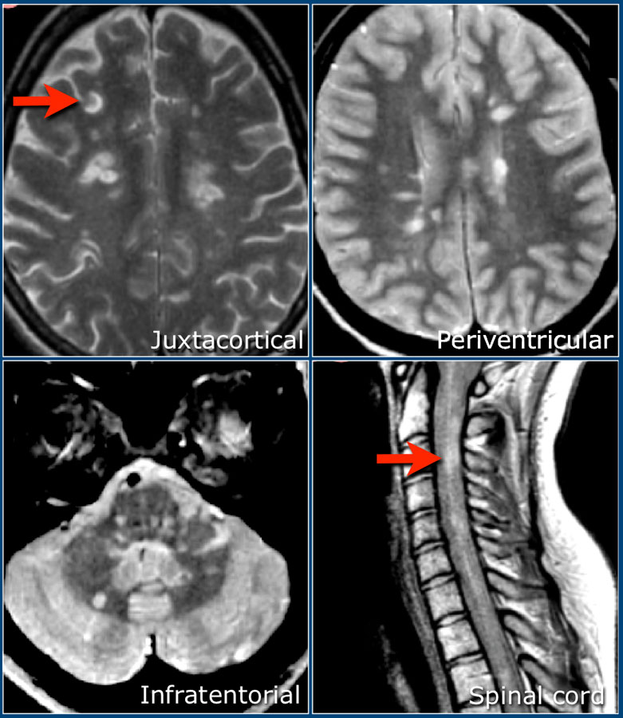
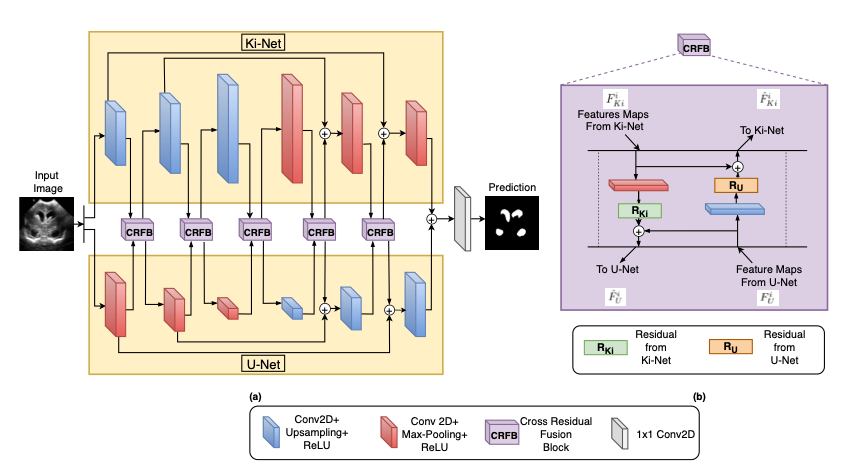
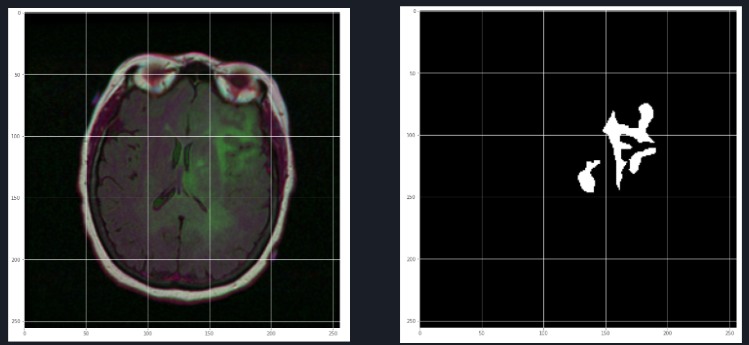
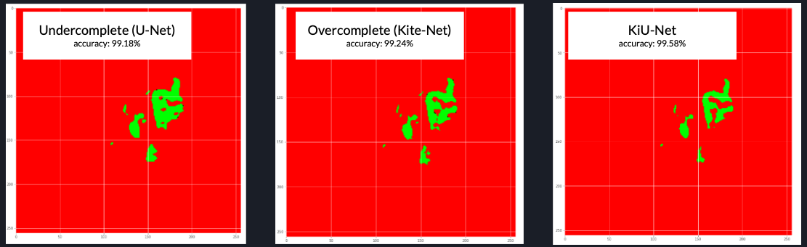
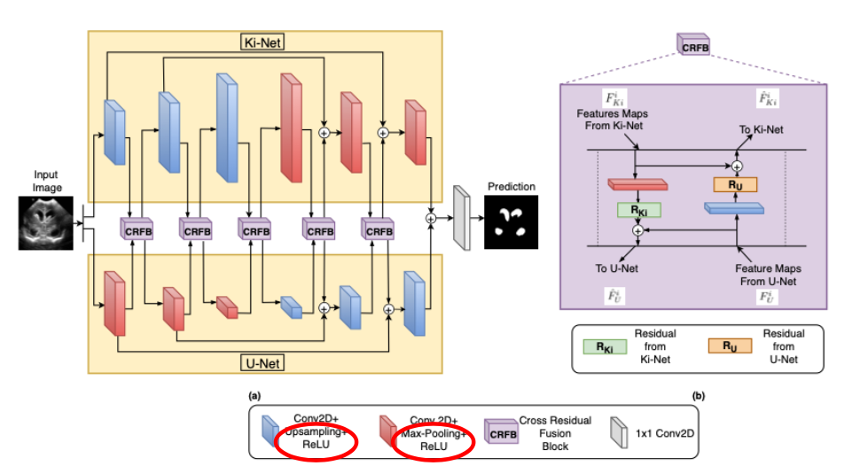
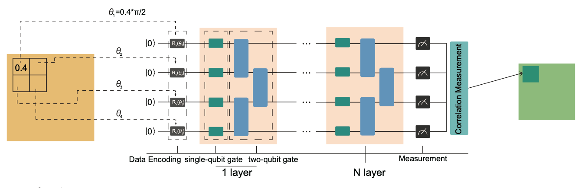
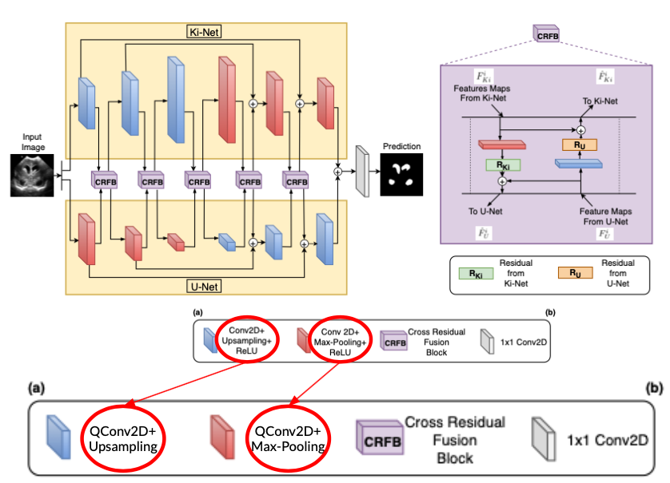
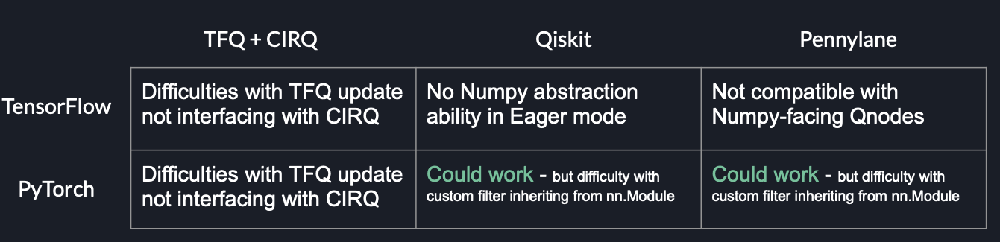

# Hybrid Quantum-Classical KiU-Net for Biomedical Image Segmentation

A bit of background before diving in:

A couple of months ago, my friend and I were just chatting and catching up on the phone. She works in a lab that, among other things, has recently started leveraging computer vision AI techniques to assist in the diagnosis of Multiple Sclerosis through detection of MS lesions found in brain MRI scans. 

 
 
[img_source](https://radiologyassistant.nl/neuroradiology/multiple-sclerosis/diagnosis-and-differential-diagnosis)

Although I had been working on several computer-vision based projects (GANs, Style Transfer networks, etc.) for more natural science-based topics already (ex. custom CNN for predicting wind speed from tropical storm images), I hadn't yet fully grasped the potential of utilizing computer vision in biomedical imaging applications. After my conversations with my friend though, it was clear that this is a field where the applications of AI would be able to help so many people, and maybe even save lives! I knew it was something that I needed to pursue further.

My first introduction to a biomedical imaging segmentation algorithm was [U-Net](https://arxiv.org/abs/1505.04597), which is considered to be the industry standard of biomedical image segmentation. Although it certainly does a fantastic job in most applications, I noticed through various online discourse that some people were dissappointed with how it had trouble detecting smaller-scale objects, or more intricate structures.

In the paper [KiU-Net](https://arxiv.org/abs/2006.04878): Towards Accurate Segmentation of Biomedical Images using Over-complete Representations by Jeya Maria Jose et al., they discuss how in the architecture of U-Net, the image is projected onto a smaller spatial dimension by use of max pooling blocks in the first half, followed by upsampling in the architecture later on. Because of this projection onto a smaller spatial dimension, U-Net is great at detecting overall larger-scale objects, but may not be fully harnessing a computer's ability to detect small-scale objects. To combat this, Jose et al. proposed using an architecture called Ki-Net, which projects the image onto a higher spatial dimension, encouraging the algorithm to analyze some of the smaller anatomical landmarks. Ki-Net is then combined with U-Net to create KiU-Net, which is the architecture shown below:

[source](https://arxiv.org/abs/2006.04878)

So I decided to give it a shot! I used TensorFlow as the platform for machine learning, and came up with the results displayed below (Note: I apologize for the red/green masks - these will be changed asap!)

Original Image: [source](https://www.kaggle.com/mateuszbuda/lgg-mri-segmentation)

Results:

# So how does quantum fit in to the picture?

To understand this, we should first take a look at how a classical 2D convolution operation is done. One step in a convolution operation is to utilize kernel “windows” of different weighted values sliding over the input image to obtain data about the image by creating feature maps:

These feature maps are constructed by performing the dot product of the corresponding values on the kernel matrix and the window of the image that it is currently over. This is a linear combination, which means that if we would like to see any potential nonlinear interactions between the pixels, we need to implement an external activation function such as ReLU to explicitly bring nonlinearity:

But what if we had a way to bring this nonlinearity, instead of utilizing the dot product or some other linear combination?

Enter quantum. The idea is adapted from the [paper](https://arxiv.org/pdf/1911.02998.pdf) Hybrid Quantum-Classical Convolutional Neural Networks, and is like this: 

[source](https://arxiv.org/pdf/1911.02998.pdf)

Instead of performing the dot product between the image pixels and kernel window, compute the expectation value of a Parameterized Quantum Circuit (PQC), where the values of the image pixels and the (trainable) weights of the kernel window are the parameterized values in the algorithm. 

Because PQCs are just quantum algorithms that depend on free parameters, they (like standard quantum circuits) consist of 3 ingredients:
- Preparation of a fixed initial state
- Unitary quantum circuit parameterized by a set of free parameters (theta)
- Measurement of an observable at the input

If the parameters of this unitary quantum circuit (the weights of the filter) are trainable, then what's to say it can't be used as a convolutional layer? Also, this method has the potential to better capture the cross-correlation inside each window because taking the expectation value of the observable is a nonlinear function. And because this is an inherently nonlinear function, we do not need any additional function to explicitly bring nonlinearity:

Also, unlike the standard QCNN, this version of using QCCNN is more suitable for NISQ-era devices because it only requires (nxm) qubits for kernel size (nxm).

# Quantum Implementation Methodologies

Based on the available Python ML libraries and quantum SDKs, this is a visual representation of the methodologies that I can see for this project. I also included why I believe some of them may be more difficult to implement than others, based on my trial-and-error thus far. 

The first quantum SDK I learned about is [Qiskit](https://qiskit.org), an open-source SDK for working with quantum computers at the level of pulses, circuits, and application modules. Unfortunately, Qiskit is not compatible with what I have worked with so far in TensorFlow because of TensorFlow's incompatibility with Numpy in Eager mode. (see broad_strokes.ipynb for more details, if you can comb through it! I'll clean that up soon.) This is also the case for [PennyLane](https://pennylane.ai), which is built upon numpy arrays as well (see messy_drafts/quantum_test_pennylane.ipynb). For using [TensorFlow Quantum](https://www.tensorflow.org/quantum) (TFQ) with [Cirq](https://quantumai.google/cirq), you can check out the issues I've been having in the file messy_drafts/cirq_attempt.ipynb.

I look forward to attempting the creation of a quantum convolutional block that can interface with PyTorch, as I've read that PyTorch has Numpy interfacing capabilities. So far, I've had difficulties creating a custom class that can even just perform the dot product, let alone perform the PQC, so this might take another week or so to fully exhaust.

Thanks for reading, and I look forward to keeping this updated!
